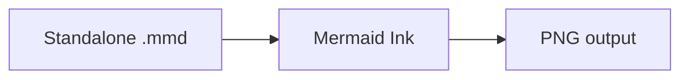
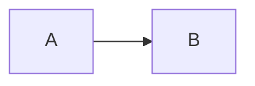
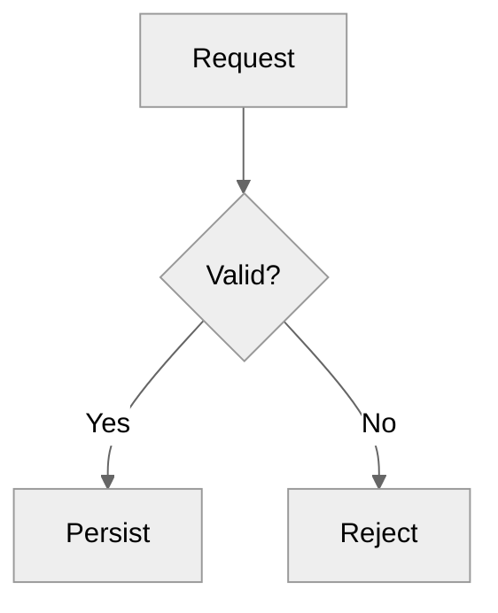

# Mermaid input for Mermaid Ink

The renderer accepts only a raw Mermaid source file with the `.mmd` suffix. It
does not compile Markdown, extract a Mermaid field from YAML/JSON, or discover a
diagram inside prose. The file may come from any workflow; it does not need to
originate from an artifact or another skill.

## Preferred input

Pass one raw Mermaid diagram as a `.mmd` UTF-8 file.

Valid:
- raw Mermaid body
- optional Mermaid frontmatter followed by the diagram

Extract first:
- Markdown fenced Mermaid
- YAML fields
- JSON strings
- Mermaid embedded in prose

## Extract embedded Mermaid

The first Mermaid statement must declare the diagram type. The following is a
complete valid file:



Save only the three lines inside the documentation fence. Do not save the
opening or closing backticks.

These forms are not valid renderer inputs:

````text

````

```yaml
diagram: |-
  flowchart LR
      A --> B
```

For either case, extract the body beginning with `flowchart LR` into a new
`.mmd` file. Do not pass the Markdown fence, YAML key, block-scalar marker, or
indentation container to this skill.

## Author or repair a diagram first

If raw Mermaid does not already exist, author or extract it into a standalone
`.mmd` file before rendering.

If the source is invalid, repair it before retrying.

Do this directly when practical. If the `mermaid-diagrams` skill is available,
it is an optional authoring and repair aid; rendering does not require that
skill.

For example:

```bash
python D:\Inter-K\src\agent_skills\builtin\render-to-image\scripts\render_to_image.py \
  --input /absolute/path/to/scratch/system-flow.mmd \
  --output /absolute/path/to/scratch/system-flow.png
```

## Configuration frontmatter

Mermaid configuration frontmatter is part of raw Mermaid source and may appear
before the diagram declaration:



This is Mermaid frontmatter, not a YAML container around the diagram. Keep the
diagram declaration immediately after the closing `---`.

## Renderer behavior and compatibility

The script sends the source unchanged to Mermaid Ink; it does not parse,
normalize, or repair Mermaid.

Mermaid Ink controls the Mermaid version and supported features. Syntax accepted
by another renderer may fail here.

If rendering fails:

1. Confirm the file contains only raw Mermaid.
2. If the source requires authoring, repair, or compatibility changes, correct the
standalone `.mmd` first, then render again.
